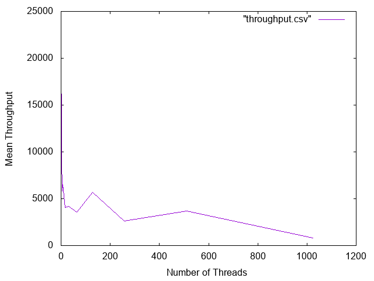
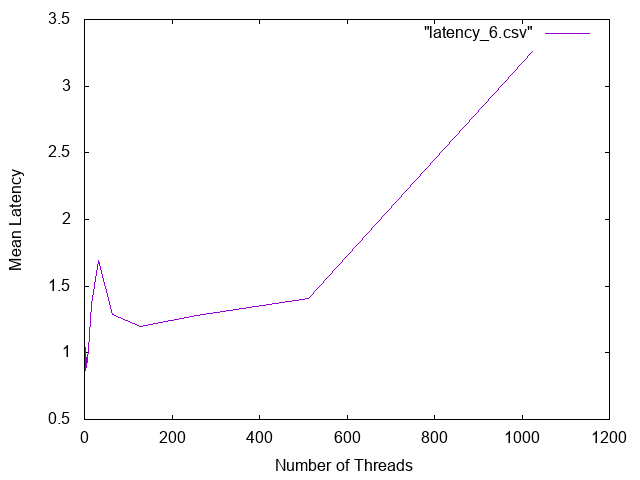
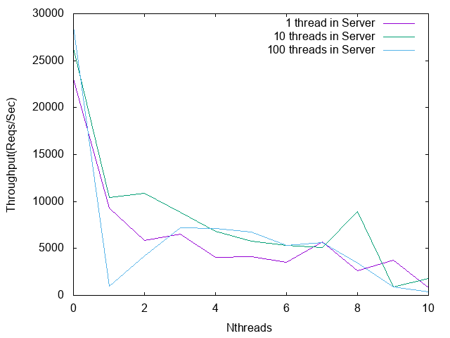
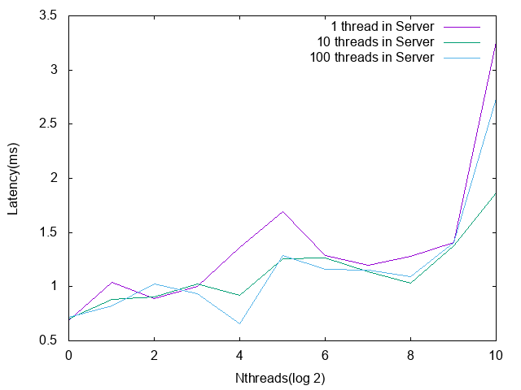

# CS 389 HW 06 - (A feeble attempt to) crank it up
### Names : Prasun and Hrishee

## New File Overview
`hw_6_systems.zip` : zip file submission of our repository. Refer to our [README for HW4](https://github.com/prg007/Lets_Network) for why we need a zip file.
Inside, we modified

`driver.cc` : now has a multithreaded version of the benchmarking program

`cache_server.cc` : now is a multithreaded server

## Getting Started
Please follow the instructions of how to set up and compile in our [README for HW4](https://github.com/prg007/Lets_Network).
The compilation instructions are identical.

### How to run the benchmark
Refer to our  [README for HW5](https://github.com/prg007/HW5---Network-Benchmark) for instructions on how to run.
`driver.cc` now takes an `nthreads` parameter : the number of client threads to run. Furthermore, you can change the number of
server threads to run by doing `./server -t N` where N is the number of server threads.

#### Disclaimer
Our data was hindered by the fact that we could not send more than 15000 requests for our benchmark (a reappearing bug
from HW5) but we made with what we had. Our data was very finicky. This could be attributed to the fact that every time we restarted the server(everytime it crashed) the throughput increased (maybe because
the server works better if it gets a rest). To remedy this, we took the mean across 4 trials for each thread.
Another thing we hypothesize is that the combination of crow(server side) and cpr(client side) libraries might have caused the client to be optimized for a single thread for a smaller number of requests.
If we had a higher number of requests to process we could have encountered different results. Our testament to this is the fact that graph reaches a peak again at around 128 threads
before dipping from that point onwards making us believe that the libraries might be optimized(especially cpr) for single threads to handle a smaller number of requests.
If it wasn't optimized then we would have seen a strictly decreasing graph(for throughput) which wasn't the case.

## Part 1
For all of our experiments, we kept all parameters constant except for the number of client threads:

`./driver 7000 1000000 15000 100 100 50 22 1 N` where `N` is the number of client threads.

In other words, `nreq = 7000`, `maxmem = 1000000`, `NUM_REQ = 15000`, key pool and value pool sizes = `100`,
and get:set:del ratios were 50:22:1.

The graph below shows the average throughput (in requests/sec) as a function of the number of
client threads. We took 4 trials for each thread and computed the graph for latency and throughput with the mean for each thread.

The graph below shows the average latency (in ms) as a function of the number of
client threads.

Strangely enough, our saturation point seems to be at 1 client thread, where we had a throughput of
23031 req/sec and a 95th percentile latency of 0.68925.
Notice that we obtain an unusually high throughput for one client thread, and the throughputs seem to
taper off from there. Perhaps our implementation is flawed, but apart from that, another possible reason is that
as the number of client threads increases, the single threaded server cannot keep up with the demand from
a growing number of clients -- which means each client thread has to wait longer on average to be served.

## Part 2
For all of our experiments in part 2, we kept all parameters constant except for the number of client threads and server threads:

`./driver 7000 1000000 15000 100 100 50 22 1 N` where `N` is the number of client threads.

`./server -t M` where `M` is the number of server threads (make sure maxmem is set to 1000000).

We ran both the client and the server on the same machine, so that may have affected our data as well.
The two graphs below plot the average throughput and 95th percentile latencies as a function of the number of client threads (x-axis)
and number of server threads (blue, purple, green lines).

Our new saturation point seems to be around 1 client thread and 100 server threads, with a throughput of 28571 requests/sec and a
95th percentile latency of 0.718. We can see that in general, having 10 server threads outperforms 1 and 100 server threads in terms of higher throughput.
The real saturation point (in terms of number of server threads) may be somewhere between 10 and 100 threads, but a more fine grained analysis is needed.
Overall, the fact that our saturation points occur with 1 client thread suggests that something might have gone wrong on the client side for reasons mentioned above.
